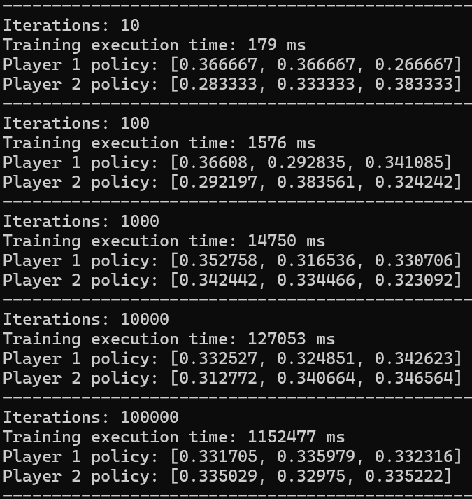
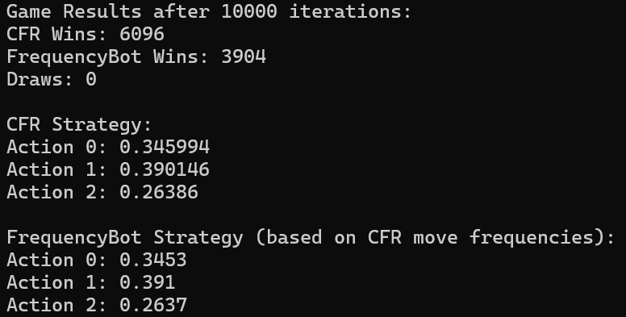
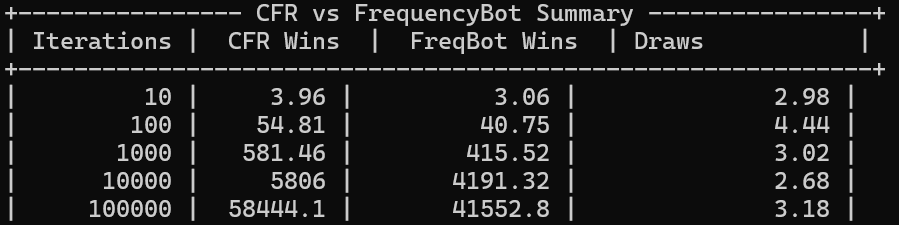
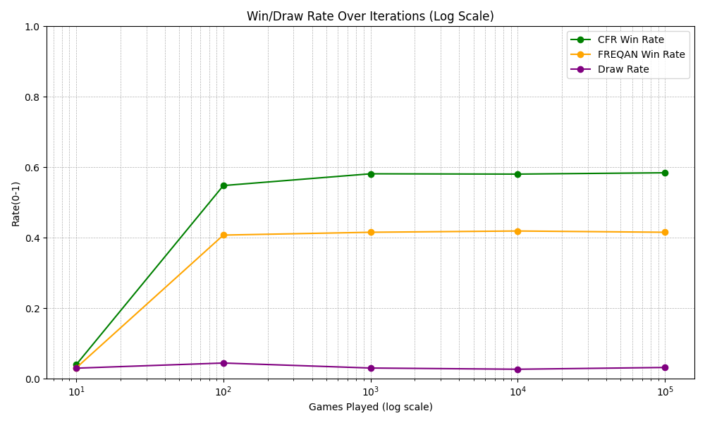
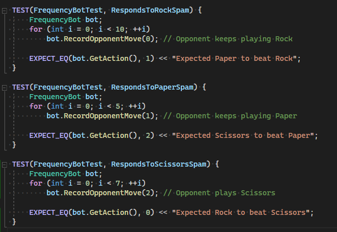
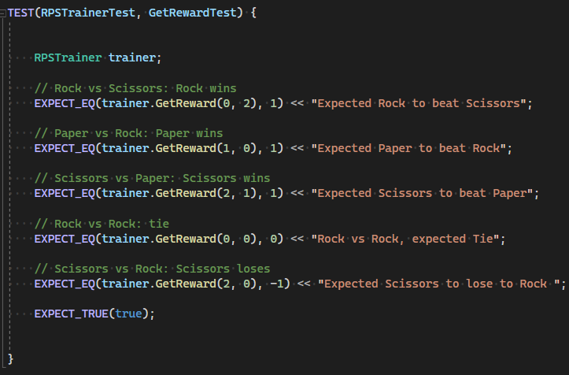
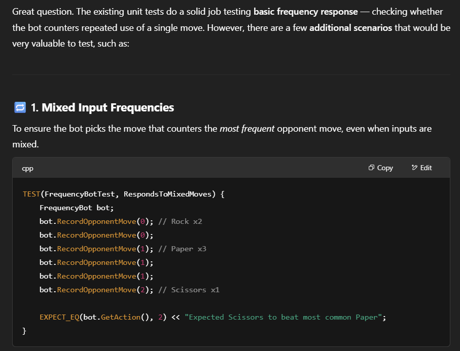
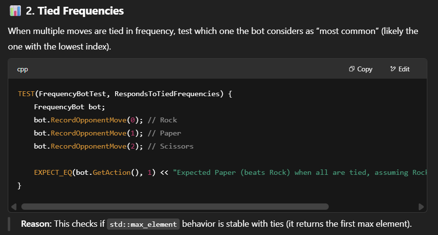
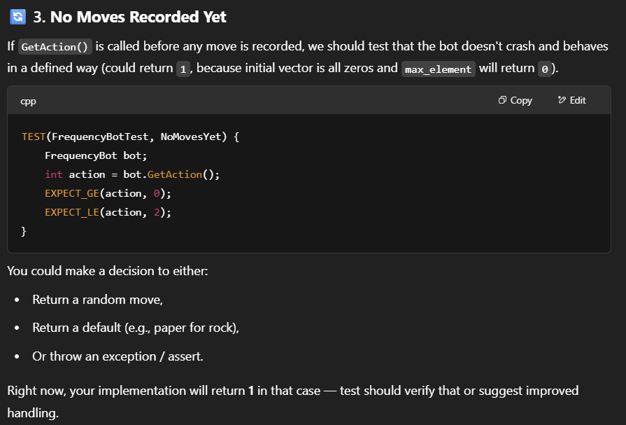

# 2ManLier'sGame

## Contents

- The 2 Man Lier's Game
- Counterfactual Regret Minimization (CFR)
- On Rock Paper Scissors
- On the 2 Man Lier's Game

## The 2 Man Lier's Game

This Game is a simplified version of the Roblox game ["Lier's Club"](https://www.roblox.com/games/81080628786688/Liars-Club).
It consists of **2 players**, each dealt **4 cards** from a deck containing: 2 **KINGS**, 2 **QUEENS**, 2 **ACES**, and 2 **JOKERS** (8 cards in total).

Each round, a card type (KING, QUEEN, or ACE) is randomly chosen to be the active type for that round (JOKER cannot be chosen as the active type).

Players take turns placing up to 3 cards face down. The cards they play may either match the active type or not. Cards that match the active type are played truthfully, while any others represent a bluff. JOKERs can be played as wildcards, and always count as matching the active type (i.e., they are never considered a bluff).

After a player places their cards, the other player has two options:

1.Call Bluff – If they believe the previous player lied (i.e., played cards that did not match the active type), they can call bluff.

 - If the bluff is correctly called (i.e., at least one of the played cards was not the active type, excluding Jokers), the challenger wins the round.

 - If the bluff call was incorrect (i.e., all cards were of the active type or Jokers), the challenger loses the round.

2.Play Cards – The player may instead choose to continue the round by placing their own cards (up to 3), following the same rules.

If a player plays all their cards, the other player is forced to call bluff, since they can no longer respond with cards.

## Counterfactual Regret Minimization (CFR)

Counterfactual Regret Minimization (CFR) is an algorithm used to approximate Nash equilibria in imperfect-information games—like poker or, in our case, the 2 Man Lier's Game. These are games where players make decisions without full knowledge of the opponent’s actions, requiring a strategy that accounts for uncertainty.

### Regret
In CFR, regret refers to the hypothetical difference between the reward you actually received for an action, and the reward you could have received had you made a better choice. It’s a way to evaluate:

"If I had taken a different action in this situation, would I have done better?"

Over time, the algorithm adjusts its behavior to favor decisions that lead to less regret and avoid those that increase it.

### The Core Loop

The CFR algorithm proceeds in iterations, and each one looks like this:

1. Traverse the game tree:
    - The algorithm simulates both players playing the game.
    - It recursively visits each possible game state (node in the game tree).
2. Calculate counterfactual values:
    - For each decision point (called an information set), CFR computes the expected utility of taking each possible action, as if the player had reached that point.

    - These are counterfactuals because they ask, “What would my outcome be if I were here and took action a?”
3. Update regrets:
    - It compares the utility of each action to the utility of the action that was actually taken.

    - The difference is stored as regret for not having chosen the better alternative.
4. Update the strategy:
    - Using regret values, it re-weights the probabilities of actions at each decision point.

    - More favorable actions (lower regret) become more likely over time.

## On Rock Paper Scissors

### CFR vs CFR 
In this implementation, we modeled the Rock-Paper-Scissors (RPS) game using Counterfactual Regret Minimization (CFR) to train two bots to play optimally over repeated iterations. Each bot maintains a cumulative regret for each action, which measures how much better it could have done had it played differently in past rounds. At each training iteration, the bots convert their regret sums into a mixed strategy by focusing only on positive regrets, normalizing them to form a probability distribution; if all regrets are non-positive, the bot plays uniformly at random. Both bots sample their actions from their respective strategies using a discrete probability distribution. After each round, they calculate their rewards based on the RPS payoff matrix, update their regrets accordingly, and accumulate their strategy probabilities to compute average strategies over time. This iterative process allows the bots to adjust their play towards a Nash equilibrium, where neither player can gain by unilaterally changing their strategy, effectively learning to play RPS optimally through self-play.

The results below show how each bot develops its strategy over time and how those strategies converge toward expected outcomes:

  

### CFR VS FREQUENCY BOT

In this simulation, a CFR-based bot plays against a Frequency Analysis bot in repeated rounds of Rock-Paper-Scissors. The CFR bot continuously updates its strategy by tracking and accumulating regrets over time, adapting its choices based on how well each possible action would have performed against the opponent's actual moves. Meanwhile, the FrequencyBot observes and records the CFR bot’s past moves, analyzing the frequency of each action to predict the most likely next move. It then counters this prediction by choosing the action that would beat the most frequent move seen so far. As a result, the CFR bot learns through regret minimization how to exploit or defend against the FrequencyBot’s adaptive pattern, while the FrequencyBot tries to anticipate and exploit recurring tendencies in the CFR bot’s behavior. 

The results below show the average number of wins for each bot, as well as the average number of draws, across simulations with different iteration counts:

  

 

  

 

  

## Testing

To ensure the correctness of the implementation, we used unit testing to verify that the functions return the expected results in various scenarios. This approach allowed us to quickly identify potential logical errors or unexpected behavior in the code. The unit tests were written using the Google Test (gtest) framework.

Some Examples:

|  |  | 
|---|---|
|   | |

### The usage of AI in testing

Given the code and the existing tests written by us, we asked ChatGPT if it could suggest additional possible tests and write them for us. This was its response:

|  |  |  |
|---|---|---|
|   | | |

The complete conversation: https://chatgpt.com/share/68271e8a-17a0-800f-b8a0-c3bfeafd6d24

## VIDEO DEMO
The project itself: https://www.youtube.com/watch?v=16mmXHYV6Oc

The tests: https://www.youtube.com/watch?v=4Pxa3bLVLOE

## Resources
- Martin Zinkevich, Michael Johanson, Michael Bowling, Carmelo Piccione Regret Minimization in Games with Incomplete
Information, 2008
- Todd W. Neller, Marc Lanctot An Introduction to Counterfactual Regret Minimization, 2013
- Xinyu Zhang Learn AI Game Playing Algorithm Part III — Counterfactual Regret Minimization

